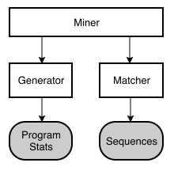

# Mining Programs

The source code in this folder is used for mining LODA programs that generate integer sequences from the OEIS database.
The high-level architecture is shown below.
The mining process is coordinated in the [Miner](miner.cpp) class. It uses [Generator](generator.hpp) instances to
produce random LODA programs, which are evaluated and matched against the integer sequence database using instances of
the [Matcher](matcher.hpp) class. If a generated program matches a sequence and there is no known program for it or it is considered better as the existing one, it is written to the programs folder and submitted to the central API server.



There are multiple generator and matcher implementations available. They are configured and combined in the central mining configuration file [miners.json](../../miners.default.json).
A miner profile has the following basic properties:

- "enabled": Boolean to easily enable or disable a profile.
- "backoff": Boolean to control the back-off strategy during sequence matching.
- "overwrite": Controls whether existing programs should be overwritten. Possible values are "none", "auto" or "all".

See below for further details on the [program generation](#program-generation) and [sequence matching](#sequence-matching).

## Program Generation

There are multiple generators available with differing strategies. They can generate programs either randomly or deterministically. Random program generators can use statistics on existing LODA program to define probability distributions. We also distinguish between generators that create programs from scratch, or that mutate
randomly chosen existing programs, or use patterns or templates to create programs.

All generator implement the [Generator](generator.hpp) interface. They are identified using a plain version number and instantiated using a factory class.
For more details on the available generators and their strategies, see below.

### Generator Version 1

[GeneratorV1](generator_v1.cpp) produces random programs from scratch or from existing program templates. It includes several configuration options, for example, to control the approximate length of the programs and the used operation and operand types. For constants, it uses a distribution derived from the program stats. Historically,
this generator found many simple programs in the early days of the project. However, nowadays it hardly finds new
programs. This is mainly because it is stateless: it does not use any probabilistic model for
dependencies between multiple operations in a generated program.

```json
{
    "name": "my-generator",
    "version": 1,
    "length": 40,
    "maxIndex": 8,
    "loops": false,
    "calls": false,
    "indirectAccess": false,
    "template": [
        "$LODA_HOME/programs/templates/call2.asm",
        "$LODA_HOME/programs/templates/loop.asm",
      ]
}
```

### Generator Version 2

[GeneratorV2](generator_v2.cpp) generates random programs from scratch. It uses probability distributions generated from the program stats to randomly select the program length and operation (including operand). It does not include
any configuration options and solely depends on the program stats. It is also stateless: it does not use any probabiblity distributions for sequential dependencies of operations.

### Generator Version 3

[GeneratorV3](generator_v3.cpp) also uses program length and operation distibutions. However, it uses separate
distributions per position in the program. For example, it uses different distributions for the first and the second
operation in the generated programs.

### Generator Version 4

[GeneratorV4](generator_v4.cpp) is partially deterministic and uses persistence to save its state to disk. It first
initializes around 200 random programs of varying length and complexity and stores them on disk. It uses these
random programs as *seeds* for deterministic generation using a program iterator. In a nutshell, the iterator
increases a program like a number. Hence this is an exhaustive, brute-force search.

### Generator Version 5

[GeneratorV5](generator_v5.cpp) splits up the existing programs into blocks of a few operations and uses probaility
distributions to randomly select and combine such program blocks.

### Generator Version 6

[GeneratorV6](generator_v6.cpp) is the most successful generator at the time of writing. It works quite simple:
it randomly selects one of the already existing programs and mutates them, i.e., modifies, adds or deletes operations. It includes a parameter for controlling the mutation rate. In addition, it does not use a uniform
distribution for selecting programs to mutate, but it takes into account the git history of the programs
repository. In a nutshell, it prefers to mutate recently added or modified programs.

```json
{
    "name": "my-generator",
    "version": 6,
    "mutationRate": 0.2
}
```

### Generator Version 7

[GeneratorV7](generator_v7.cpp) mutates [program patterns](https://github.com/loda-lang/loda-programs/tree/main/patterns) that have been generated using [loda-rust](https://github.com/loda-lang/loda-rust).

### Generator Version 8

[GeneratorV8](generator_v8.cpp) is not a true generator, but rather an input plugin that reads programs from a batch file. The batch filemust have the following format: every line corresponds to one program, where operations are separated using a semi-colon. This can been used for [NMT Mining](https://github.com/loda-lang/nmt-mining).

```json
{
    "name": "my-generator",
    "version": 8,
    "batchFile": "programs.txt"
}
```

## Sequence Matching

Matchers are used to match generated programs to integer sequences. They include logic to handle "almost-matching" programs. Multiple matchers can be activated in the miner configuration, for example:

```json
{
    "matchers": [
        "direct",
        "linear1",
        "linear2",
        "binary",
        "decimal",
        "delta"
      ]
}
```

Matchers perform two operations:

- **Reduce Sequences:** extract parameters from sequences and reduce sequences to more basic sequences.
- **Extend Programs:** extend generated programs using the extracted sequence parameters so that they match a target sequence.

See the examples in the following sections for better understanding of the process.

### Direct Matcher

This is the most simple of all matchers. It just evaluates the generated program for a number of terms
and matches it to sequences starting with exactly these terms. Thus, sequences are not reduced and
generated program are not extended.

### Linear Matcher 1

Supports linear output transformations to match sequences. Sequences are reduced as follows:

1. Find the smallest non-negative term in a sequences and store it as `offset`. Subtract the `offset` from all sequence terms.
1. Find the largest positive common divisor of all sequence terms and store it as `factor`. Divide all sequence terms by the `factor`.

For example, given a sequence `36,21,42,90,51`. In the first step, it is reduced to `15,0,21,69,30` with `offset=21`. In the second step, it is further reduced to `5,0,7,23,10` with `factor=3`.

This reduction and parameter extraction is performed for all known target sequences in the OEIS database. We store an index of the reduced sequences together with their extracted offsets and factors.

A generated program is first evaluated to a sequence. This sequence is then reduced in the same way as described above. The reduced sequence is looked up in the index. If there was a match, the offsets and factors of the generated program and the target sequences are used to extend the generated program at its end with a linear transformation such that it matches the target sequence.

For example, say, we randomly generated this program:

```asm
; generated program
add $0,3
mul $0,2
pow $0,2
```

It is first evaluated to `36,64,100,144,196`. This sequence is reduced to `0,7,16,27,40,55` with `offset=36` and `factor=4`.

Now assume we are looking for a program for this sequence in the database: `1,22,49,81,121,166`. It is reduced to `0,7,16,27,40,55` with `offset=1` and `factor=3`. Notice that the reduced sequences match! Therefore, the matcher can extend the generated program as follows to match the target sequence:

```asm
; extended program
add $0,3
mul $0,2
pow $0,2
sub $0,36 ; offset of generated sequence
div $0,4  ; factor of generated sequence
mul $0,3  ; factor of target sequence
add $0,1  ; offset of target sequence
```

### Linear Matcher 2

The Linear Matcher 2 works analogously to the Linear Matcher 1, with the only difference that the sequence reduction steps are reversed: first divide by common factor, then subtract the offset.

### Decimal Matcher

This matcher supports target sequences that consist of decimal digits only.
Sequences are reduced in these steps:

1. All terms are converted to `mod 10`.
1. Find the decimal digit that occurs most often and store it as `offset`. Subtract the offset from all terms `mod 10`.

Generated programs are extended using `add` and `mod` operations to adjust offsets.

### Binary Matcher

Works analogously to the Decimal Matcher, but for sequences with binary digits (0,1).

### Delta Matcher

This matcher is used for differenc sequences and partial sums. Strictly monotonically increasing sequences are reduced to difference sequences until at least one term is zero. The number of differences operations is stored as parameter. Generated programs can be extended in two ways: the difference between consecutive terms is computed, or partial sums are computed using a loops.

Caution: this matcher and its generated programs are typically computationally expensive.
